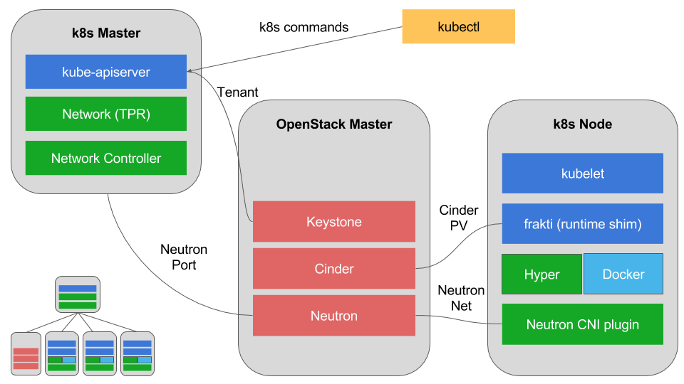

Stackube Architecture
=======================

This page describes the architecture of stackube.

==========
Overview
==========

Stackube is a Kubernetes-centric OpenStack distro. It uses Kubernetes, instead of Nova, as the compute
fabric controller, to provision containers as the compute instance, along with other OpenStack
services (e.g. Cinder, Neutron). It supports multiple container runtime technologies, e.g. Docker,
Hyper, and offers built-in soft/hard multi-tenancy (depending on the container runtime used).

============
Architecture
============

===========
Components
===========

1. Standard OpenStack Compoents

* OpenStack Keystone
* OpenStack Neutron
* OpenStack Cinder

2. Standard Kubernetes Components

* Etcd: the storage of kubernetes.
* Kube-apiserver: the API, authn/authz and admission control of kubernetes.
* Kuber-controller-manager: the brain of kubernetes, ensure the state of kubernetes cluster.
* Kube-scheduler: the scheduler of kubernetes.
* Kubelet: the container lifecycle and volume manager of kubernetes.
* Frakti&HyperContainer: a hypervisor-based container runtime.
* Docker: docker container runtime.

3. Stackube addons

* Stackube-controller: tenant and network manager.
* Stackube-proxy: service discovery and load balancing, replacement of kube-proxy.
* Kubestack: the CNI network plugin, which connects containers to Neutron network.

